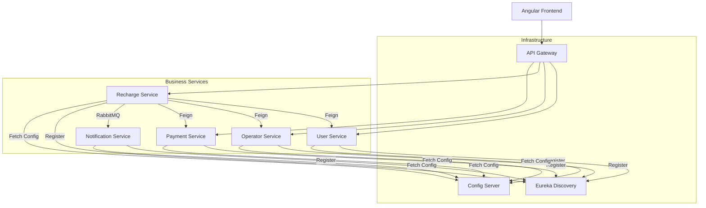

# OmniRecharge - Full Stack Microservices Mobile Recharge Platform

OmniRecharge is a high-performance, scalable mobile recharge platform built using a modern **Microservices Architecture**. It leverages the Spring Cloud ecosystem for backend services and Angular for a dynamic, premium frontend experience.

## 🏗️ Architecture Overview

The system is composed of several specialized microservices, each handling a distinct domain of the application. They communicate via synchronous REST APIs (using OpenFeign) and asynchronous messaging (using RabbitMQ).



## 🛠️ Technology Stack

### **Backend (Spring Boot 3.x)**
- **Spring Cloud Gateway**: Centralized entry point with JWT-based security.
- **Netflix Eureka**: Service discovery and registry.
- **Spring Cloud Config**: Centralized external configuration.
- **Spring Data JPA**: Persistence layer using MySQL.
- **OpenFeign**: Declarative REST client for inter-service communication.
- **RabbitMQ**: Message broker for asynchronous notifications.
- **Zipkin/Brave**: Distributed tracing for observability.
- **Lombok**: Boilerplate reduction.

### **Frontend (Angular 18)**
- **Reactive Forms**: Sophisticated validation and state management.
- **RxJS**: Reactive programming for data streams.
- **Vanilla CSS**: Premium, custom-built design system with dark mode.
- **Toast Notifications**: Real-time user feedback.

### **Infrastructure**
- **Docker & Docker Compose**: Containerization and orchestration.
- **MySQL**: Relational database for persistent storage.

## 🔄 Core Data Flows

### **1. User Authentication**
1. User submits credentials via Frontend.
2. **API Gateway** routes request to **User Service**.
3. **User Service** validates and returns a JWT token.
4. Gateway passes the token back to Frontend for subsequent authenticated requests.

### **2. Recharge Lifecycle**
1. **Frontend** calls **Recharge Service** to initiate a transaction.
2. **Recharge Service** performs a series of synchronous checks:
   - Fetches User details from **User Service**.
   - Validates Plan details from **Operator Service**.
   - Initiates payment via **Payment Service**.
3. If successful, **Recharge Service** publishes a message to **RabbitMQ**.
4. **Notification Service** consumes the message and sends an email confirmation.

## 📁 Project Structure

```bash
.
├── api-gateway/          # Security & Routing
├── config-server/        # Centralized Configuration
├── eureka-server/        # Service Registry
├── user-service/         # Identity & Profile Management
├── operator-service/     # Operators & Plans Management
├── recharge-service/     # Transaction & Logic Orchestrator
├── payment-service/      # Gateway Mock & History
├── notification-service/ # Messaging & Email Service
├── frontend/             # Angular 18 Application
└── docker-compose.yml    # System Orchestration
```

## 🚀 Getting Started

### **Prerequisites**
- Docker & Docker Compose
- Java 21+ (for local development)
- Node.js & Angular CLI (for local frontend)

### **Deployment**
Run the entire stack using Docker:
```bash
docker-compose up -d --build
```

Access the application at: `http://localhost:4200`
API Gateway: `http://localhost:8080`
Eureka Dashboard: `http://localhost:8761`

---
*Developed by Paila Murali Madhav*
